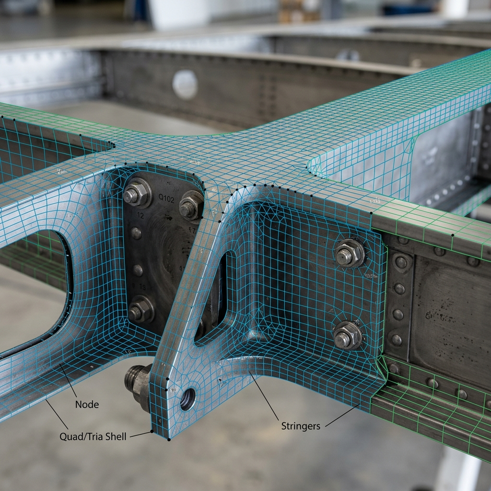
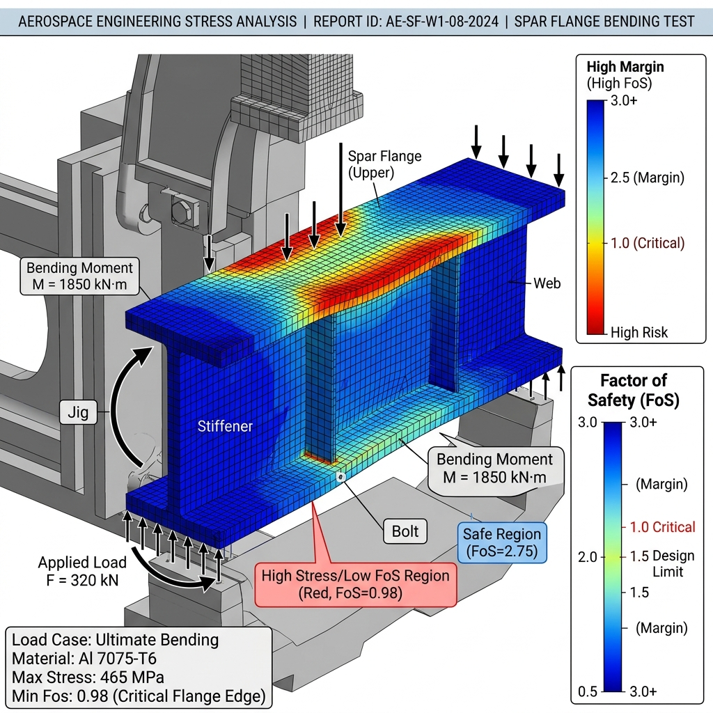

# Aircraft Wing Spar FEA Optimization

Carbon fiber composite wing spar optimization designed to sustain high bending moment loads in UAV aerodynamic cases.

## Overview
This study optimizes composite layup orientations (0/45/90 degrees) of carbon fiber spars in ANSYS ACP to minimize weight while satisfying bending and shear strength requirements.

## Objectives
- Reduce spar weight by 20% compared to baseline aluminum spar.
- Maximum deflection under peak aerodynamic loads < 25 mm.

## Simulation Results
The composite spar optimization yielded a total weight reduction of 22.4% while maintaining structural integrity.

