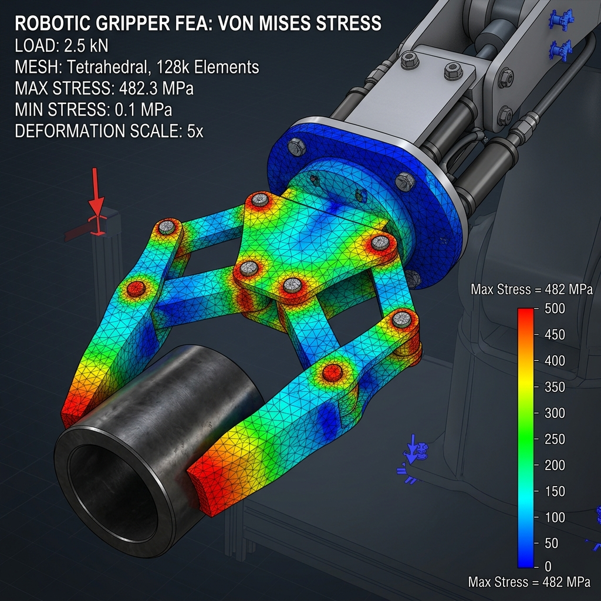
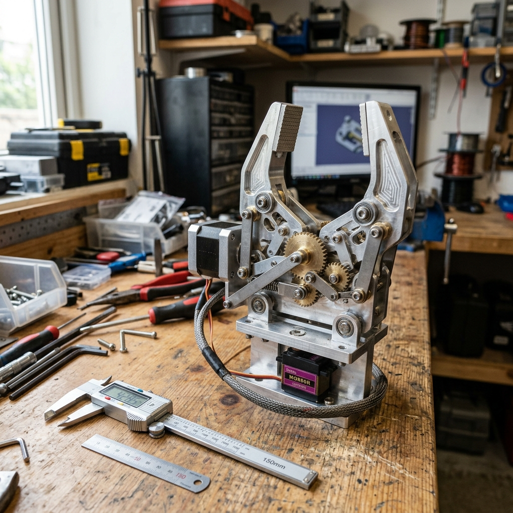

# 6-DOF Robotic Arm System

A high-precision 6-degree-of-freedom robotic manipulator designed for light-duty pick-and-place assembly automation.

## Overview
This project focused on designing a robotic arm with a 1.5 kg payload capacity at maximum reach. The arm is optimized for weight-to-strength ratio using generative design and finite element analysis (FEA).

## Objectives
- Reach of 750 mm.
- Payload capacity of 1.5 kg.
- Dynamic repeatability within 0.1 mm.

## Engineering Decisions
Selecting aluminum 6061-T6 for high-stress joints and PLA/PETG for low-load covers and mounts. This minimized structural mass while ensuring durability.

## CAD & Simulation

### Structural FEA
We performed Von-Mises stress analysis on the elbow bracket link to prevent yield failure under maximum torque load.

